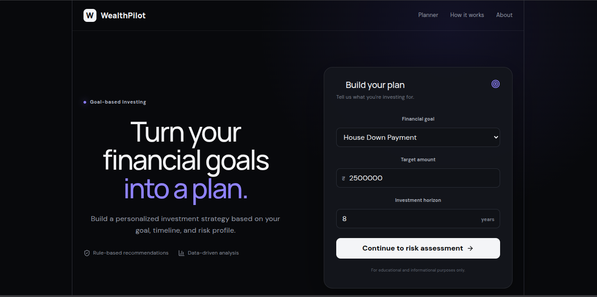
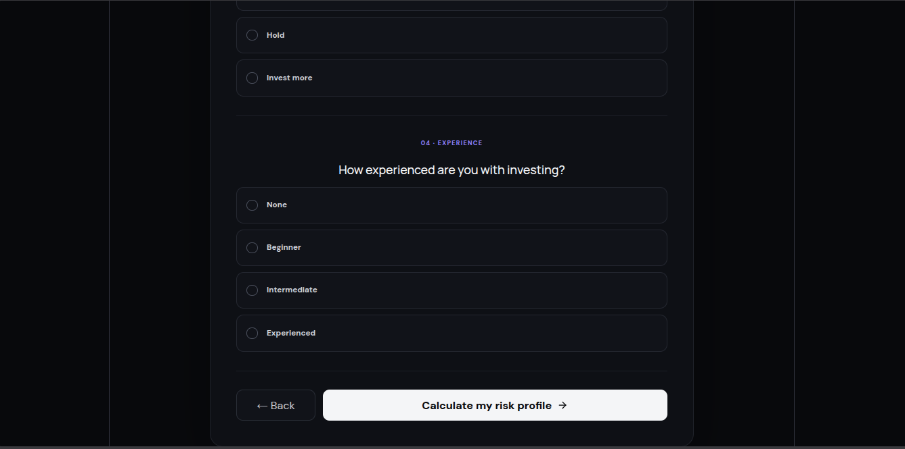
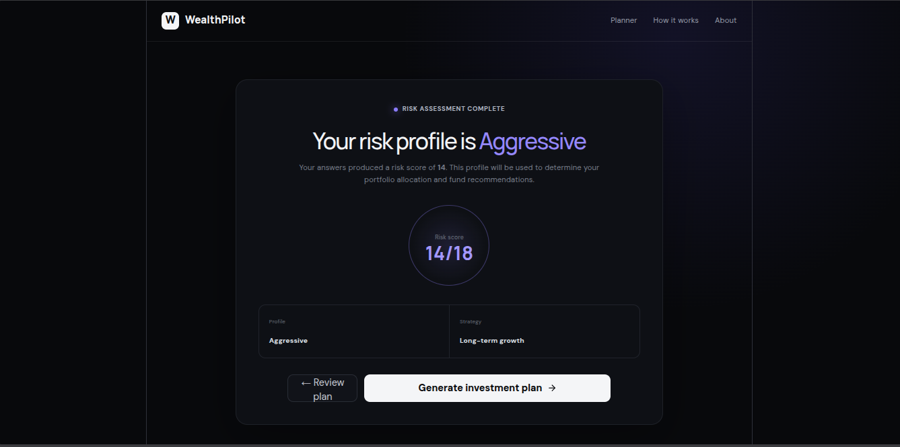
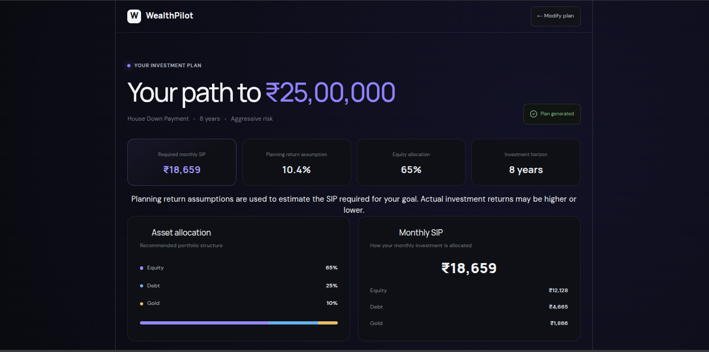
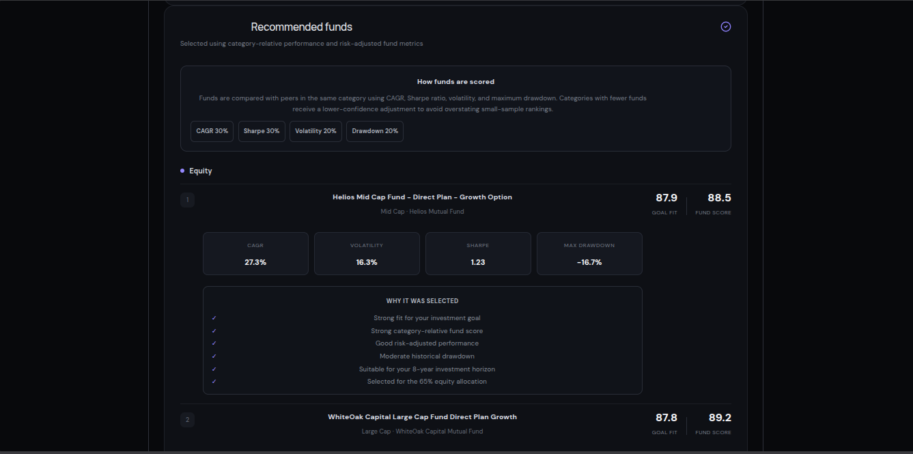

# WealthPilot — Goal-Based Mutual Fund Robo-Advisor

WealthPilot is a goal-based mutual fund robo-advisor that creates personalized investment plans based on an investor's financial goal, target amount, investment horizon, and risk profile.

Instead of simply ranking mutual funds by historical returns, WealthPilot combines:

- Risk profiling
- Goal-based asset allocation
- Dynamic glide-path allocation
- Variable-return SIP calculations
- Scenario projections
- Category-relative fund scoring
- Goal-specific fund selection
- Explainable fund recommendations

The project is built as a full-stack application with a Python/FastAPI backend and a React + TypeScript frontend.

---

## Screenshots

### Goal Planner



### Risk Assessment



### Risk Assessment Result



### Generated Investment Plan



### Fund Recommendations



---

## 🚀 Live Demo

**Live Application:**  
https://wealthpilot-iota.vercel.app/

**Backend API:**  
https://wealthpilot-2929.onrender.com/

**API Documentation:**  
https://wealthpilot-2929.onrender.com/docs

> The frontend is deployed on Vercel and the FastAPI backend is deployed on Render.


## Key Features

### 🎯 Goal-Based Investment Planning

Users can create an investment plan based on:

- Investment goal
- Target amount
- Investment horizon
- Risk profile

Supported goals include:

- Emergency Fund
- House Down Payment
- Education
- Retirement
- Wealth Creation

### 🧠 Risk Profiling

A questionnaire evaluates the investor's:

- Age
- Income stability
- Investment horizon
- Loss tolerance
- Investment experience

The resulting risk score maps the investor to:

- Conservative
- Moderate
- Aggressive

### 📊 Dynamic Asset Allocation

The system allocates investments across:

- Equity
- Debt
- Gold

Allocation changes over the investment horizon through a glide path, gradually reducing equity exposure as the goal approaches.

### 💰 Variable-Return SIP Planning

Instead of assuming one constant annual return throughout the entire investment period, WealthPilot derives monthly return assumptions from the glide path.

The required monthly SIP is then calculated against those changing return assumptions.

### 📈 Scenario Projections

The application provides:

- Conservative projection
- Base projection
- Optimistic projection

This helps illustrate how different return assumptions can affect the final portfolio value.

### 🔎 Goal-Aware Fund Selection

Funds are evaluated using category-relative metrics including:

- CAGR
- Sharpe ratio
- Volatility
- Maximum drawdown

Goal-specific weights are then applied depending on the investor's objective.

### 💡 Explainable Recommendations

Every recommended fund includes reasons explaining why it was selected, including:

- Category-relative fund score
- Risk-adjusted performance
- Historical volatility
- Historical drawdown
- Investment horizon suitability
- Allocation within the portfolio

---

## What Makes This Project Different?

WealthPilot is designed around the idea that **the best fund is not necessarily the fund with the highest historical return**.

A suitable recommendation depends on:

> **Goal + Horizon + Risk Profile + Asset Allocation + Fund Quality**

The system therefore separates the problem into multiple stages:

1. Understand the investor.
2. Determine the appropriate risk profile.
3. Construct a goal-based asset allocation.
4. Adjust the allocation over time.
5. Calculate the required SIP.
6. Evaluate suitable mutual funds.
7. Adjust fund selection according to the investor's goal.
8. Generate an explainable investment recommendation.


---

---

## System Architecture

WealthPilot follows a layered architecture that separates data processing, investment planning, recommendation logic, API services, and the frontend.

```text
                    ┌─────────────────────────┐
                    │      React Frontend     │
                    │     TypeScript + Vite   │
                    └────────────┬────────────┘
                                 │
                                 │ REST API
                                 ▼
                    ┌─────────────────────────┐
                    │      FastAPI Backend    │
                    │     /api/recommendation │
                    └────────────┬────────────┘
                                 │
                    ┌────────────▼────────────┐
                    │ Recommendation Service  │
                    └────────────┬────────────┘
                                 │
              ┌──────────────────┼──────────────────┐
              ▼                  ▼                  ▼
       ┌─────────────┐    ┌─────────────┐    ┌─────────────┐
       │ Goal        │    │ Fund        │    │ Risk        │
       │ Planning    │    │ Selection   │    │ Profiling   │
       └──────┬──────┘    └──────┬──────┘    └─────────────┘
              │                  │
              ▼                  ▼
       ┌─────────────┐    ┌─────────────┐
       │ Glide Path  │    │ Fund Scoring│
       │ + SIP       │    │ + Goal      │
       │ Calculations│    │ Preferences │
       └──────┬──────┘    └──────┬──────┘
              │                  │
              └─────────┬────────┘
                        ▼
               ┌──────────────────┐
               │ Final Investment │
               │ Recommendation   │
               └──────────────────┘
```

---

## Recommendation Pipeline

A user's request flows through the system in the following stages.

### 1. User Input

The frontend collects:

- Investment goal
- Target amount
- Investment horizon
- Risk assessment responses

The risk assessment produces a risk profile that is passed to the backend.

### 2. Goal Planning

The planning layer creates the investment plan based on the selected risk profile and investment horizon.

It determines:

- Asset allocation
- Glide path
- Expected return
- Monthly return assumptions
- Required SIP
- Portfolio projection
- Scenario projections

### 3. Glide Path Generation

The initial portfolio allocation is gradually adjusted as the investor approaches the goal.

Equity exposure is reduced while more defensive assets such as debt become more prominent.

This is intended to reduce portfolio risk as the goal date approaches.

### 4. Variable-Return SIP Calculation

The glide path produces a sequence of monthly return assumptions.

The required SIP is calculated using these changing monthly returns rather than assuming one constant annual return for the entire investment horizon.

### 5. Fund Scoring

Mutual funds are evaluated relative to other funds within the same category.

The scoring system considers:

- CAGR
- Sharpe ratio
- Volatility
- Maximum drawdown

Each metric is normalized into a comparable score before being combined into the overall category-relative fund score.

### 6. Goal-Aware Fund Selection

Different financial goals prioritize different characteristics.

For example:

- **Emergency Fund** → greater emphasis on stability
- **House Down Payment** → greater emphasis on risk control
- **Education** → balanced growth and stability
- **Retirement** → greater emphasis on long-term growth
- **Wealth Creation** → stronger emphasis on growth

Goal-specific weights are applied to the underlying fund metrics before selecting recommendations.

### 7. Explainable Recommendations

The final recommendations combine:

- Investor risk profile
- Investment goal
- Investment horizon
- Asset allocation
- Required SIP
- Fund quality
- Goal-specific suitability

Each recommended fund includes an explanation describing why it was selected.

### 8. Frontend Presentation

The FastAPI backend returns the completed recommendation to the React frontend.

The frontend presents:

- Investment summary
- Asset allocation
- SIP allocation
- Portfolio glide path
- Portfolio projection
- Scenario projections
- Recommended funds
- Fund scores
- Fund selection explanations

---

## Data Flow

```text
User
  │
  ▼
Goal + Target + Horizon
  │
  ▼
Risk Assessment
  │
  ▼
Risk Profile
  │
  ▼
Goal Planner
  │
  ├── Asset Allocation
  ├── Glide Path
  ├── Expected Return
  ├── Required SIP
  └── Portfolio Projections
  │
  ▼
Fund Universe
  │
  ├── Category Filtering
  ├── Category-Relative Scoring
  └── Goal-Adjusted Scoring
  │
  ▼
Fund Selection
  │
  ▼
Explainable Recommendation
  │
  ▼
FastAPI
  │
  ▼
React Frontend
```

---

## Project Structure

```text
mutual-fund-robo-advisor/
│
├── api/
│   └── main.py
│
├── config/
│   ├── constants.py
│   ├── fund_universe.py
│   └── settings.py
│
├── data/
│   └── processed/
│       ├── fund_metadata.csv
│       ├── fund_metrics.csv
│       └── fund_metrics_clean.csv
│
├── data_pipeline/
│   ├── build_dataset.py
│   ├── clean_dataset.py
│   ├── fund_metadata.py
│   ├── metrics.py
│   └── nav_fetcher.py
│
├── planning/
│   ├── glide_path.py
│   ├── goal_planner.py
│   ├── return_assumptions.py
│   └── sip_calculator.py
│
├── recommendation/
│   ├── asset_allocation.py
│   ├── fund_selector.py
│   ├── goal_preferences.py
│   ├── recommendation_engine.py
│   ├── scoring.py
│   └── service.py
│
├── risk_profiling/
│   ├── questionnaire.py
│   ├── risk_profiles.py
│   └── scoring.py
│
├── tests/
│   ├── test_api.py
│   ├── test_asset_allocation.py
│   ├── test_full_pipeline.py
│   ├── test_glide_path.py
│   ├── test_goal_planner.py
│   ├── test_goal_preferences.py
│   ├── test_recommendation.py
│   ├── test_risk_profiling.py
│   ├── test_scoring.py
│   ├── test_service.py
│   ├── test_sip_calculator.py
│   └── test_variable_projection.py
│
├── frontend/
│   ├── src/
│   │   ├── App.tsx
│   │   ├── App.css
│   │   └── main.tsx
│   ├── package.json
│   └── vite.config.ts
│
├── notebooks/
│   ├── 01_data_exploration.ipynb
│   ├── 02_fund_analysis.ipynb
│   └── 03_recommendation_validation.ipynb
│
├── requirements.txt
└── README.md
```


---

## Quantitative Methodology

WealthPilot combines rule-based financial planning with quantitative fund analysis. The objective is to make the recommendation process transparent rather than treating the fund selection as a simple return-ranking problem.

### 1. Risk Profiling

The application evaluates the investor using a structured questionnaire covering factors such as:

- Age
- Income stability
- Investment horizon
- Loss tolerance
- Investment experience

The questionnaire produces a numerical risk score which is mapped to one of three profiles:

- Conservative
- Moderate
- Aggressive

The resulting risk profile is then used by the planning engine to determine the portfolio's asset allocation.

---

## 2. Asset Allocation

The portfolio is divided across three broad asset classes:

- Equity
- Debt
- Gold

The allocation depends on the investor's risk profile and investment horizon.

For example, for a 15-year horizon with a Moderate risk profile, the portfolio begins with:

```text
Equity: 65%
Debt:   25%
Gold:   10%
```

The allocation is then progressively adjusted as the goal approaches.

This separates two important decisions:

```text
Risk Profile
      +
Investment Horizon
      ↓
Asset Allocation
```

---

## 3. Portfolio Glide Path

WealthPilot uses a glide path to gradually make the portfolio more defensive as the goal approaches.

For example, an 8-year Moderate portfolio follows a progression similar to:

```text
Stage          Equity    Debt    Gold
--------------------------------------
Current          50%      40%     10%
Stage 2          28%      62%     10%
Stage 3           6%      84%     10%
Final 2 years     0%      90%     10%
```

The glide path is used for both:

- Portfolio allocation
- Monthly return assumptions

This means the return model changes as the portfolio becomes more conservative.

---

## 4. Return Assumptions

Expected portfolio return is derived from the asset allocation rather than being entered manually for each recommendation.

The system calculates the expected return from the allocation of:

```text
Equity
   +
Debt
   +
Gold
   ↓
Expected Portfolio Return
```

The expected return is used for scenario analysis and portfolio planning.

---

## 5. Variable-Return SIP Calculation

A major part of the planning engine is the use of variable monthly returns.

Instead of assuming:

```text
8 years → same return every month
```

the system derives monthly return assumptions from the portfolio glide path.

For an 8-year horizon, the resulting monthly return schedule changes as the portfolio becomes progressively more defensive.

Conceptually:

```text
Early years
Higher equity exposure
        ↓
Higher expected monthly return

Later years
Lower equity exposure
        ↓
Lower expected monthly return
```

The required SIP is then calculated against this sequence of changing monthly returns.

This allows the SIP calculation to reflect the changing risk profile of the portfolio over time.

---

## 6. Portfolio Projection

Once the required SIP has been calculated, WealthPilot generates a month-by-month portfolio projection.

Each projection point contains:

- Month
- Year
- Total amount invested
- Portfolio value
- Target amount
- Surplus or gap

The projection therefore allows the frontend to show both portfolio growth and progress toward the investor's target.

For example:

```text
Monthly SIP
     ↓
Monthly return assumptions
     ↓
Portfolio value over time
     ↓
Comparison with target amount
```

The final projection is designed to reach the target amount under the return assumptions used by the planning model.

---

## 7. Scenario Projections

In addition to the primary variable-return projection, WealthPilot generates multiple return scenarios.

These are used to illustrate how portfolio outcomes can change under different return assumptions.

The frontend presents the scenarios alongside the main investment projection so that users can understand that the outcome is not guaranteed.

---

## 8. Category-Relative Fund Scoring

Funds are not scored across the entire universe as if every mutual fund category had the same characteristics.

Instead, funds are compared against other funds within their own category.

Four historical metrics are used:

| Metric | Weight |
|---|---:|
| CAGR | 30% |
| Sharpe Ratio | 30% |
| Volatility | 20% |
| Maximum Drawdown | 20% |

Each metric is converted to a 0–100 score using min-max normalization.

For metrics where a higher value is preferable:

```text
Score = (Value - Minimum)
        ------------------- × 100
        (Maximum - Minimum)
```

For metrics where a lower value is preferable, the score is inverted.

This produces:

```text
CAGR Score
Sharpe Score
Volatility Score
Drawdown Score
       ↓
Weighted Combination
       ↓
Raw Fund Score
```

---

## 9. Category Confidence Adjustment

Categories with very few funds can produce unstable rankings.

To reduce the impact of small sample sizes, the system applies a category confidence adjustment.

The confidence is calculated as:

```text
confidence = min(1.0, (category_size - 1) / 9)
```

The final category-relative fund score is then shrunk toward 50 when category confidence is low:

```text
Fund Score =
    50 + confidence × (Raw Fund Score - 50)
```

This means a fund in a category with limited data does not receive an artificially extreme score simply because it happens to rank highly within a very small peer group.

---

## 10. Goal-Adjusted Fund Scoring

The overall fund score is not the only factor used for recommendation.

Different investment goals prioritize different characteristics.

WealthPilot therefore applies goal-specific weights to the four underlying metric scores.

### Emergency Fund

```text
CAGR:          10%
Sharpe Ratio:  25%
Volatility:    30%
Drawdown:      35%
```

The emphasis is placed on stability and downside protection.

### House Down Payment

```text
CAGR:          15%
Sharpe Ratio:  30%
Volatility:    25%
Drawdown:      30%
```

### Education

```text
CAGR:          25%
Sharpe Ratio:  30%
Volatility:    20%
Drawdown:      25%
```

### Retirement

```text
CAGR:          35%
Sharpe Ratio:  30%
Volatility:    15%
Drawdown:      20%
```

### Wealth Creation

```text
CAGR:          40%
Sharpe Ratio:  30%
Volatility:    15%
Drawdown:      15%
```

The goal-adjusted score is calculated as a weighted combination of the existing metric scores:

```text
Goal Score =
    CAGR Score × CAGR Weight
  + Sharpe Score × Sharpe Weight
  + Volatility Score × Volatility Weight
  + Drawdown Score × Drawdown Weight
```

This allows the same fund universe to be evaluated differently depending on the investor's objective.

---

## 11. Fund Selection Process

After scoring, the recommendation engine applies additional suitability filters.

The selection process considers:

1. Asset class
2. Investment horizon
3. Suitable mutual fund categories
4. Goal-specific score
5. Category diversity

The system avoids selecting multiple funds from the same category when building the recommendation set.

For example:

```text
Equity
 ├── Fund A → Mid Cap
 └── Fund B → Large Cap

Debt
 ├── Fund C → Liquid
 └── Fund D → Ultra Short Duration

Gold
 └── Fund E → Fund of Funds
```

This provides category diversification within each asset class.

---

## 12. Explainability Layer

The recommendation engine converts quantitative results into human-readable explanations.

A fund can be selected because of factors such as:

- Strong category-relative fund score
- Good risk-adjusted performance
- Moderate historical volatility
- Moderate or limited historical drawdown
- Suitability for the investment horizon
- Fit with the portfolio's asset allocation

The goal is to make the recommendation understandable rather than presenting the user with unexplained numerical rankings.

---

## Quantitative Pipeline Summary

```text
Investor Inputs
      │
      ▼
Risk Score
      │
      ▼
Risk Profile
      │
      ▼
Asset Allocation
      │
      ▼
Glide Path
      │
      ▼
Monthly Return Schedule
      │
      ├───────────────┐
      ▼               ▼
Required SIP     Portfolio Projection
                      │
                      ▼
               Scenario Analysis


Fund Dataset
      │
      ▼
Category Filtering
      │
      ▼
Metric Normalization
      │
      ▼
Category-Relative Score
      │
      ▼
Goal-Adjusted Score
      │
      ▼
Fund Selection
      │
      ▼
Explainable Recommendation
```

---

## Design Philosophy

The core design principle of WealthPilot is:

> **Investment recommendations should be goal-aware, risk-aware, and explainable.**

Historical performance alone does not determine whether a fund is appropriate for an investor.

The system therefore combines:

```text
Investor Profile
        +
Financial Goal
        +
Investment Horizon
        +
Portfolio Allocation
        +
Fund-Level Quantitative Metrics
        ↓
Explainable Recommendation
```

This makes the project a combination of **financial planning, quantitative analysis, and full-stack application engineering** rather than a simple mutual fund ranking system.

---

## Tech Stack

### Backend

- Python
- FastAPI
- Pydantic
- Pandas
- NumPy
- SciPy
- yfinance
- mftool

### Frontend

- React
- TypeScript
- Vite
- Tailwind CSS
- Recharts
- Lucide React

### Testing

- Pytest
- HTTPX

---

## Getting Started

### Prerequisites

Make sure the following are installed:

- Python 3.12+
- Node.js
- npm
- Git

---

## 1. Clone the Repository

```bash
git clone https://github.com/abhiminav/wealthpilot
cd mutual-fund-robo-advisor
```

---

## 2. Backend Setup

Create and activate a Python virtual environment:

```bash
python3 -m venv .venv
source .venv/bin/activate
```

Install the Python dependencies:

```bash
pip install -r requirements.txt
```

---

## 3. Start the FastAPI Backend

From the project root:

```bash
uvicorn api.main:app --reload --port 8000
```

The API will be available at:

```text
http://127.0.0.1:8000
```

FastAPI also provides interactive API documentation at:

```text
http://127.0.0.1:8000/docs
```

---

## 4. Frontend Setup

Open a second terminal and navigate to the frontend:

```bash
cd frontend
```

Install the Node.js dependencies:

```bash
npm install
```

Start the development server:

```bash
npm run dev
```

The frontend will normally be available at:

```text
http://localhost:5173
```

---

## 5. Run the Application

Once both servers are running:

```text
React Frontend
     │
     │ HTTP request
     ▼
FastAPI Backend
     │
     ▼
Recommendation Engine
```

Open the frontend URL in your browser and create an investment plan.

---

## API

### Health Check

```http
GET /
```

Example response:

```json
{
  "name": "Goal-Based Robo-Advisor API",
  "status": "running",
  "version": "1.0.0"
}
```

### Health Endpoint

```http
GET /health
```

Example response:

```json
{
  "status": "healthy"
}
```

### Generate Recommendation

```http
POST /api/recommendation
```

Request body:

```json
{
  "goal_type": "House Down Payment",
  "target_amount": 2500000,
  "horizon_years": 8,
  "risk_profile": "Moderate",
  "funds_per_asset": 2
}
```

The API returns a complete recommendation containing:

- Goal information
- Risk profile
- Asset allocation
- Expected return
- Required monthly SIP
- SIP allocation
- Glide path
- Portfolio projection
- Scenario projections
- Recommended funds
- Fund explanations

---

## API Validation

The API validates incoming requests using Pydantic.

For example:

- `target_amount` must be greater than zero.
- `horizon_years` must be greater than zero.
- `goal_type` must not be empty.
- `risk_profile` must not be empty.
- `funds_per_asset` must be between 1 and 5.

Invalid planning inputs are returned as HTTP `400` responses.

Unexpected server-side failures are returned as HTTP `500` responses.

---

## Running Tests

The project includes automated tests covering the major components of the system.

Run the complete test suite with:

```bash
python -m pytest -q
```

The current test suite contains:

```text
69 tests
```

The tests cover areas including:

- Risk profiling
- Asset allocation
- Glide paths
- Goal planning
- SIP calculations
- Variable-return projections
- Fund scoring
- Goal-adjusted scoring
- Fund selection
- Recommendation pipeline
- API endpoints
- Service layer

---

## Frontend Quality Checks

### Production Build

From the `frontend` directory:

```bash
npm run build
```

This runs TypeScript compilation followed by the Vite production build.

### Linting

```bash
npm run lint
```

The frontend currently passes linting with zero warnings and zero errors.

---

## Development Workflow

A typical local development workflow is:

### Terminal 1 — Backend

```bash
cd ~/Data\ Science\ Projects/mutual-fund-robo-advisor
source .venv/bin/activate
uvicorn api.main:app --reload --port 8000
```

### Terminal 2 — Frontend

```bash
cd ~/Data\ Science\ Projects/mutual-fund-robo-advisor/frontend
npm run dev
```

### Terminal 3 — Tests

```bash
cd ~/Data\ Science\ Projects/mutual-fund-robo-advisor
source .venv/bin/activate
python -m pytest -q
```

---

## Production Frontend Build

To create a production build:

```bash
cd frontend
npm run build
```

The compiled frontend is generated in:

```text
frontend/dist/
```

The backend can be run separately using an ASGI server such as Uvicorn.

---

## Data

The project uses processed mutual fund data stored in:

```text
data/processed/
```

The main dataset used by the recommendation engine is:

```text
fund_metrics_clean.csv
```

The data pipeline contains separate modules for:

- Fund metadata
- NAV retrieval
- Metric calculation
- Dataset construction
- Dataset cleaning

The processed dataset is then consumed by the recommendation service.

---

## Environment Variables

The project currently does not require secrets to run the core recommendation engine locally.

If environment-specific configuration is introduced in the future, sensitive values should be stored in environment variables rather than committed to Git.

Never commit API keys, tokens, passwords, or other secrets to the repository.


---

## Testing & Validation

The project uses automated tests to validate the major components of the recommendation pipeline.

The current test suite contains:

```text
69 tests
```

The tests cover:

- Risk profiling
- Risk profile mapping
- Asset allocation
- Glide path generation
- Monthly return generation
- SIP calculations
- Variable-return projections
- Goal-specific scoring
- Category-relative fund scoring
- Fund selection
- Recommendation generation
- API endpoints
- Service-layer integration
- Full recommendation pipeline

The frontend has also been validated through:

- TypeScript production builds
- Vite production builds
- Oxlint

Current frontend lint result:

```text
0 warnings
0 errors
```

---

## Limitations

WealthPilot is an educational and portfolio-development project and should not be treated as professional financial advice.

Some important limitations include:

### Historical Data

Fund rankings are based on historical metrics such as CAGR, volatility, Sharpe ratio, and maximum drawdown.

Historical performance does not guarantee future performance.

### Simplified Return Assumptions

Expected returns are model assumptions derived from asset-class allocations and are not predictions of actual future market returns.

### Glide Path Model

The glide path uses predefined allocation rules based on risk profile and investment horizon.

Real-world portfolio management may require more sophisticated dynamic allocation techniques.

### Mutual Fund Universe

Recommendations are limited to the mutual fund dataset available to the application.

The dataset may not represent every available mutual fund or the latest market information.

### No Personal Financial Context Beyond the Questionnaire

The application does not currently account for every factor that a professional financial advisor might consider, such as:

- Existing investments
- Existing liabilities
- Tax situation
- Insurance coverage
- Inflation-specific goal adjustments
- Detailed cash-flow planning
- Liquidity requirements

### No Guaranteed Outcomes

The projected portfolio values and required SIP calculations are model outputs based on assumptions.

They should not be interpreted as guaranteed investment outcomes.

---

## Responsible Use

WealthPilot is designed to demonstrate how quantitative analysis and rule-based financial planning can be combined into an explainable investment-planning system.

The recommendations should therefore be treated as **educational estimates and analytical outputs**, not as personalized financial advice.

Users should independently evaluate investment decisions and consult a qualified financial professional where appropriate.

---

## Future Improvements

The current release focuses on building a complete end-to-end recommendation pipeline.

Planned improvements for future versions include:

### Version 2

- Allow users to change the investment horizon directly from the generated plan page.
- Regenerate the complete recommendation when the horizon changes.

### Potential Future Enhancements

- Inflation-adjusted goal planning
- Tax-aware recommendations
- Expense-ratio analysis
- More detailed fund-level risk metrics
- Portfolio rebalancing recommendations
- Historical backtesting
- More advanced optimization techniques
- User accounts and saved investment plans
- Improved market-data refresh workflows
- Production deployment and monitoring

---

## Project Status

### Version 1 — Complete ✅

WealthPilot V1 is fully implemented, tested, and deployed.

- Complete goal-based investment planning pipeline
- Risk assessment and profiling
- Dynamic asset allocation
- Portfolio glide paths
- Variable-return SIP calculations
- Scenario projections
- Goal-aware mutual fund selection
- Explainable recommendations
- FastAPI backend
- React + TypeScript frontend
- Automated test suite
- Production deployment
- Live frontend and backend

## Why I Built This

This project was built to explore the intersection of:

- Data science
- Quantitative finance
- Financial planning
- Recommendation systems
- Backend API development
- Frontend engineering

The goal was not simply to create a mutual fund ranking system, but to build a complete decision-support pipeline that connects an investor's goal and risk profile to an explainable portfolio recommendation.

---

## Author

**Abhinav Mishra**

B.Tech Computer Science & Engineering

Interested in:

- Data Science
- Machine Learning
- Quantitative Finance
- AI Engineering
- Financial Technology

---

## 🌐 Deployment

| Component | Platform | Status |
|---|---|---|
| Frontend | Vercel | 🟢 Live |
| Backend API | Render | 🟢 Live |
| Source Code | GitHub | 🟢 Public |

**Live Application:** https://wealthpilot-iota.vercel.app/

**API:** https://wealthpilot-2929.onrender.com/

## Disclaimer

This project is for educational and demonstration purposes only.

It does not constitute financial, investment, tax, or legal advice.

Mutual fund investments are subject to market risks. Past performance is not indicative of future results. Always perform your own research and consult a qualified financial professional before making investment decisions.